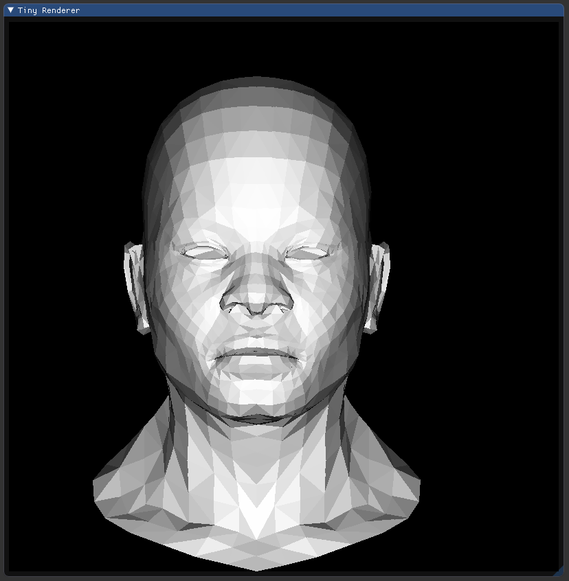

# cg_playground
A project where I can play around with computer graphics a little bit.
My idea is to implement a series of small projects inside this one as I slowly 
progress through computer graphics topics.

## Tiny renderer
I'm implementing my own version of [this](https://github.com/ssloy/tinyrenderer/wiki) great tutorial, the idea is
to implement a renderer step-by-step: implement line drawing, then .obj parsing, then wireframe rendering and so on.
This is my progress so far:

